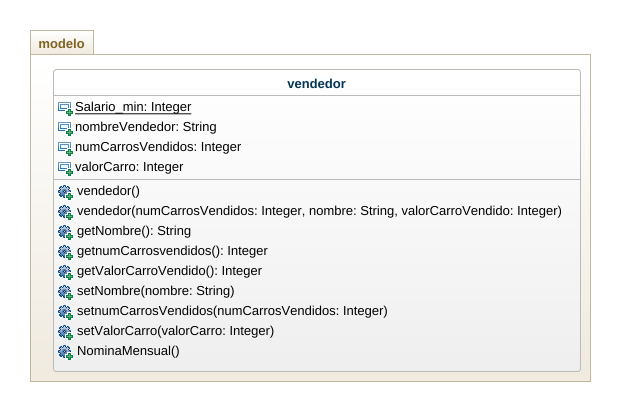

# quiz_2_POO

El sueldo que perciben los vendedores de una empresa automotriz está integrado de la siguiente manera:
- Salario minimo.
- $100000 por cada carro vendido.
- 2% del valor de los carros vendidos.

Se tienen varios vendedores, y por cada vendedor se tiene el nombre y el precio de cada carro que vendió en el mes. Es posible que algunos vendedores no hayan ralizado venta alguna, en tal caso solo se tendrá el nombre.

Elaborar un programa con su diagrama de clases que permita leer los datos e imprimir el reporte de nómina mensual.

# Diagrama de clases

# Captura de pantalla